# CellQuant V2: HPC preparation and result import

Date: 2026-09-29  
Status: implementation handoff; proposed behavior, not an implemented feature  
Target: Windows preparation/review and Alpine Linux execution through Slurm

## 1. Outcome and scope

Add an **HPC prep** workflow that lets a lab user prepare an experiment without a local GPU, transfer a validated package to Alpine, submit a GPU job, and bring the results back into CellQuant V2 for inspection, threshold adjustment, editing, and export.

The scientific result must come from V2's existing analysis pipeline. Preparation must preserve raw intensities and metadata; it must not run segmentation or silently change the recipe. The engineer should deliver this as an epic with the implementation slices in section 12.

### Decisions for this implementation

These are specification decisions, not claims about existing functionality:

- First scheduler: Slurm on Alpine. Cluster addresses, accounts, partitions, GPU resource strings, limits, and environment paths are supplied through a validated cluster profile; do not hard-code historical settings as current policy.
- One frozen recipe, one Cellpose engine/model, and one sequential, single-GPU job per package. Users create separate packages for different engines or recipes.
- Users perform transfer and submission with generated commands. CellQuant does not log into Alpine, store credentials, or submit jobs itself.
- Preparation exports all channels and Z planes losslessly for each selected acquisition. Projection, plane selection, normalization, segmentation, measurement, and classification happen on the worker.
- Imported results create a **new, self-contained V2 experiment**. Attaching results to an existing experiment is outside the first release. This avoids overwriting local edits or hiding imported results behind an older `working/` result.
- Local manual label edits and approvals are not sent for replay on newly segmented objects. The preparation summary states this explicitly. The frozen recipe does include the user's current marker thresholds.
- First-release target: both V2 Cellpose engines and all four existing Z modes. Each engine/mode combination remains disabled in a shipped profile until its required validation passes. No substitution of engine, model, device, or Z mode is permitted.

### Outside this release

Slurm arrays, multiple GPUs per job, multi-node processing, automated SSH/SFTP, cloud schedulers, a remote monitoring service, Open OnDemand Job Composer integration, automatic cluster environment installation, parameter sweeps, tissue ROIs, and biological-replicate statistics. The existing sweep and local five-step workflow remain available.

Success is a verified round trip: select two acquisitions locally, prepare and transfer their package, execute on Alpine, download results, import on Windows, and review/edit/export the imported objects without rerunning segmentation or requiring the original ND2 files.

## 2. Verified starting point

Source inspected on 2026-09-29. References are repository-relative unless marked **old**. Line numbers are navigation aids and may move.

| Component | Current behavior | Consequence for this feature |
|---|---|---|
| `cellquant/image.py:117`, `:204` | `load_image()` handles channel/Z interpretation, position and calibration overrides; `inspect_image()` returns ND2 positions. Arrays are `CYX` or `CZYX`. | Reuse interpretation and metadata rules. Never copy the old exporter's array-axis assumptions. |
| `cellquant/experiment.py:42` | Image records contain IDs, source paths, position, calibration, inclusion and user metadata. | Freeze selected image records, not just filenames. |
| `cellquant/recipe.py:220`, `:269` | Typed recipes reject unknown fields and have a scientific content hash. | Put scheduler and transport settings in separate models. |
| `cellquant/pipeline.py:64` | `process_image()` is the shared scientific entry point and accepts a `LoadedImage`. | Use this entry point on the cluster, after loading the correct acquisition. |
| `cellquant/controller.py:676` | `_load_record()` supplies position, XYZ overrides and recipe Z settings. | Extract/reuse an equivalent public loading helper for the worker and parity tests. |
| `cellquant/storage.py:111`, `:219` | Native persistence supports GUI review, but reload reconstructs only part of QC and returns empty report/combination tables. | Extend persistence additively to round-trip all `ImageResult` fields. |
| `cellquant/controller.py:120` | Result recall prefers memory, then `working/`, then the latest run. | Import into a new experiment with no preexisting working results. |
| `cellquant/controller.py:451`, `:588` | Cold-session editing can enter `_analyze()`; cache setup checks the installed engine before using labels. | Add an explicit saved-label remeasurement path so imported results remain editable without the cluster engine installed locally. |
| `cellquant/gui/app.py:549`, `:576` | Background worker and busy-state infrastructure exist. | Use it for preparation, validation and import; keep the UI responsive. |
| `cellquant/sweep.py:368`, `:527` | Sweep units resume independently, but sweep execution uses its own design/quantification and runs sequentially. | Reuse ideas or small utilities, not the sweep's reduced output as native HPC results. |
| `pyproject.toml` | Python >=3.11; separate Cellpose 3 and Cellpose 4 extras. | One pinned Linux environment per engine. No napari dependency on compute nodes. |

The old subsystem is in sibling `Napari/_cellquant/_pipeline/src/cellquant/hpc/`. Read `contract.py`, `acquisitions.py`, `export.py`, `validate.py`, `cluster_profiles.py`, `templates.py`, `runner.py`, and `import_results.py`, plus `docs/HPC_PREP_AND_SUBMISSION.md` and `tests/test_hpc_prep.py`.

Reuse its lossless-export checks, short acquisition names, preparation wizard structure, scratch/durable-storage separation, and explicit environment prerequisite. Rewrite adapters around V2's `Recipe`, `ImageResult`, and experiment storage. Do not import its old `RunConfig`, `RunStore`, `*.cellquant` format, mode names, or Python >=3.9 assumption. Historical profiles and local tests are references, not proof of a working Alpine deployment; the old guide records no live Alpine smoke pass.

## 3. User workflow

### Entry and preparation

Add **HPC prep** beside the local-analysis entry on the Start panel. It opens a separate workflow within the existing napari window. Users may return to local analysis without discarding its settings. An experiment must be open; new users first use V2's existing image import.

1. **Choose images.** Start with included image records. Show sample name, source-relative path, position, channels, Z planes, calibration and selection status. Let users exclude individual acquisitions. Distinguish same-named files by acquisition identity.
2. **Review analysis settings.** Show engine/model, segmentation channel, Z mode, physical/pixel size settings, measurements, thresholds and report definitions. Use the current recipe, including pending valid form changes. Preparation makes an immutable snapshot; later local changes do not mutate the package.
3. **Choose cluster resources.** Load a profile with verified runtime metadata. Enter account and remote durable/scratch roots. Show GPU, CPU count, RAM and wall time. Resource recommendations may inform these values but cannot change scientific settings.
4. **Prepare package.** Choose a short local output root outside the input tree. Display selected acquisition count, estimated uncompressed input bytes, and estimated preparation memory. Show progress by acquisition and stage; allow cancellation between safe steps.
5. **Transfer and submit.** Show the final validation report, package path, transfer instructions, cluster preflight command and submission command. Commands are available only for a READY package and fully resolved profile.
6. **Import results.** Select the matching local prepared package, downloaded results directory, and a new destination experiment directory. Preview all expected acquisitions and their outcomes. Import verified successful results and retain explicit records for failures/unfinished work.

Preparation is available without a local CUDA device, installed Cellpose model or Cellpose runtime. Basic image/recipe validation must not instantiate a segmentation model or call `engine_signature()` against the local installed engine to resolve the remote engine.

### Validation behavior

- Block an empty selection, unreadable/cloud-only input, unsupported axes/time series, invalid recipe, invalid channel index, duplicate acquisition IDs, invalid plane index, or incompatible runtime/profile.
- Preserve the current loader's supported formats and acquisition semantics. Do not silently introduce support for multi-series TIFFs or time series the loader cannot interpret. Unsupported layouts receive an actionable error.
- Require the same channel count/order and meaning across a package. If metadata names differ, require an explicit channel-layout confirmation stored in the package; do not reorder channels automatically. Different semantic layouts require separate packages in this release.
- Apply per-image calibration overrides exactly as local analysis does and record both file metadata and effective values. Distances in micrometres require appropriate calibration. For 3D HPC runs, require valid positive XYZ spacing instead of V2's current unit-anisotropy fallback; document this intentionally stricter admission rule. Pixel-only 2D analysis can proceed with an explicit uncalibrated warning. Reject unsupported non-square XY calibration rather than averaging it silently.
- For `single_plane` with no explicit index, resolve and record V2's existing middle-plane choice per acquisition. Preserve the original recipe snapshot and record this effective value separately.
- Warn that existing manual masks, exclusions of individual objects, and approvals will not be applied to the new segmentation. Image-level selection and user metadata are retained.
- Do not publish a partial package as ready. Cancellation leaves a clearly named incomplete preparation directory; retry creates a fresh preparation attempt. Sources remain read-only.

## 4. Architecture and ownership boundaries

```mermaid
flowchart LR
    A[V2 experiment and frozen recipe] --> B[Preparation service]
    B --> C[Validated portable package]
    C --> D[Manual transfer and Slurm submission]
    D --> E[Cluster preflight and scratch staging]
    E --> F[Shared V2 process_image]
    F --> G[Per-acquisition verified publication]
    G --> H[Durable result package]
    H --> I[Windows importer]
    C --> I
    I --> J[New V2 experiment: review, edit, export]
```



Add `cellquant/hpc/` with these responsibilities:

| Module | Responsibility |
|---|---|
| `models.py` | Versioned manifest, acquisition, profile, runtime, task-state and import-report models. |
| `prepare.py` | Freeze records/recipe, export inputs, build manifests/scripts, validate and publish READY. |
| `validate.py` | Shared structural, checksum and semantic validation used before submission, on the worker and before import. |
| `profiles.py` | Load/validate resource profiles and runtime contracts. |
| `templates.py` | Generate deterministic LF-only shell/Slurm scripts and a transfer/submission README. |
| `runtime.py` | Inspect installed application/dependencies/model weights and perform allocated-node GPU preflight. |
| `runner.py` | Sequential acquisition execution, status reconciliation, exclusive ownership, resume and cancellation. |
| `publish.py` | Verify and atomically publish acquisition artifacts and result indices to durable storage. |
| `import_results.py` | Validate returned artifacts and create a relocatable native experiment. |
| `__main__.py` | Thin CLI over the same services used by the GUI. |
| `cellquant/gui/hpc_panel.py` | Wizard, progress, validation feedback and generated instructions. |

Extract public image-loading/persistence helpers where needed; do not make the worker construct `AnalysisController` or import Qt. Avoid duplicating measurement, background correction, threshold logic, 3D stitching or phenotype semantics.

## 5. Portable input and identity contract

### Package layout

```text
cq_hpc_<short-id>/
  bundle.json
  recipe.yaml
  runtime.json
  cluster.json
  inputs/a000001.ome.tif
  inputs/a000002.ome.tif
  scripts/preflight.sh
  scripts/submit.sh
  scripts/job.sbatch
  README_SUBMIT.md
  checksums.json
  validation.json
  READY
```

Absolute Windows source locations go in a **local sidecar outside the transferred package**, keyed by bundle/acquisition ID. The package contains portable relative source identity, sample names and user metadata needed for analysis. The output directory and IDs must keep generated Windows paths below 240 characters; reject a too-long destination with a suggested shorter root. Emit lowercase `.ome.tif` names. Shell scripts use LF endings.

### Versioned model fields

Implement Pydantic models with explicit schema versions and rejected unknown fields. This table defines the required contract; the engineer must publish generated JSON schemas and representative valid/invalid fixtures.

| Model | Required fields |
|---|---|
| `BundleManifest` | `schema_version=1`, `kind="cellquant_v2_hpc"`, `bundle_id`, UTC `created_at`, `source_experiment_id`, `source_experiment_name`, `recipe_path`, `recipe_scientific_sha256`, `runtime_path`, `runtime_sha256`, `cluster_path`, `acquisitions[]` |
| `Acquisition` | `acquisition_id` (short package ID), `source_image_id`, `source_relative_path`, `source_file_sha256`, `source_position`, `sample_name`, `user_metadata`, `input_path`, `input_file_sha256`, `pixel_sha256`, `shape_czyx` (four positive integers, including singleton Z), NumPy `dtype`, `channel_names[]`, `channel_colors[]`, `file_spacing_xyz_um`, `effective_spacing_xyz_um`, `calibration_source`, `effective_z_mode`, nullable `effective_z_index`, `objective`, `channel_layout_confirmed`, `task_key` |
| `RuntimeContract` | `schema_version`, `runtime_id`, `python_version`, `application_build_sha256`, `dependency_lock_sha256`, complete package-version mapping, engine (`cellpose3` or `cellpose4`), exact Cellpose version, model identifier, model-file hash mapping, supported mode list, runtime validation date |
| `ClusterProfile` | `schema_version`, `profile_id`, `scheduler="slurm"`, host, account, partition, nullable QoS, GPU resource request, `gpus=1`, CPUs, memory MiB, wall-time seconds, remote durable root, scratch root, absolute environment Python path, `runtime_id`, `runtime_contract_path`, `runtime_sha256`, profile verification date, nullable live-smoke date |
| `TaskResult` | `schema_version`, bundle ID, acquisition ID, task key, attempt ID, outcome, start/end UTC times, runtime fingerprint, actual device, artifact entries (relative path, bytes, SHA-256), structured QC, warnings and error details |
| `ResultIndex` | `schema_version`, bundle ID, READY/package digest, HPC run ID, complete ordered list of all planned acquisition IDs and states, compute outcome, publication outcome, published task-result paths/hashes, timestamps and attempt history |

Use the existing recipe vocabulary (`max_projection`, `single_plane`, `stitch_slices`, `full_3d`) and normalize existing engine declarations to the runtime-contract vocabulary through one tested adapter. Do not add HPC fields to `Recipe`.

In a local profile, resolve a relative `runtime_contract_path` against the profile file's directory, never the process working directory; an absolute local path is also allowed. Preparation checks its runtime ID/hash, embeds those exact bytes as `runtime.json`, and rewrites the bundled profile reference to `runtime.json`. The bundled profile therefore contains no dependency on a local runtime-file path. Changing account, resources, remote roots or runtime after READY requires a newly prepared package. Resume requires the same bundle digest even if a scheduler-only change would leave scientific task keys unchanged.

### Lossless export

1. Read the selected acquisition with all Z planes and channels. Add a public transport-reading helper if needed; do not call default `load_image()` and inadvertently export its maximum projection. Current ND2 reading loads the whole file before selecting a position: account for this in preparation estimates and do not claim streaming ND2 support.
2. Canonicalize transport data as `CZYX`; write OME-TIFF as `ZCYX` with explicit metadata, singleton dimensions, physical units and channel identities. Preserve original dtype and every intensity value. Use BigTIFF when needed; no lossy compression, scaling, cropping, background subtraction or segmentation.
3. Reread the file and normalize its axes. Check exact shape/dtype/pixel equality, channel ordering and calibration. Handle TIFF's singleton-axis squeezing explicitly. Preserve optional display colors/objective in the manifest even if a TIFF reader does not round-trip them.
4. Store a pixel digest over a canonical header (shape, dtype, little-endian order) and contiguous canonical pixel bytes; also store the actual TIFF SHA-256. Hash the source before/after preparation or otherwise detect source changes during export; abort if it changed.
5. Preserve missing calibration as missing. Effective user overrides are authoritative; keep original file metadata separately for provenance.

### Integrity and readiness

`checksums.json` lists every immutable payload file with byte size and SHA-256, including `bundle.json`, recipe, runtime contract, cluster profile, inputs and generated scripts. It excludes itself, `validation.json`, and `READY` to avoid circular hashing. `validation.json` records validation results and the digest of `checksums.json`; `READY` contains that same digest and the bundle ID. READY is written by atomic replacement only after successful validation. Validators check its **contents and binding**, not just its existence.

Every consumer rechecks schema, path containment, required files, hashes, unique identities, channel/shape consistency and recipe/runtime compatibility. Payload paths must be relative POSIX paths contained under the package root; reject traversal, absolute paths and links resolving outside it. Do not execute commands embedded in imported metadata. Generate shell arguments using proper quoting and validate scheduler directive fields. Treat cluster configuration as structured fields, not arbitrary shell snippets.

Define `task_key` as SHA-256 of canonical JSON containing prepared pixel identity, source acquisition identity, effective calibration/channel mapping/Z selection, recipe scientific hash and runtime-contract hash. Compute a separate actual runtime fingerprint from observed application/dependencies/model hashes; it must match the contract before inference. Software version text alone, file existence, timestamps and edit counts are insufficient for reuse.

## 6. Runtime, environment and submission

### Environment provision

The cluster maintainer supplies a tested Linux environment and its exported runtime contract. Provide documented, pinned environment recipes/lock artifacts for Cellpose 3 and Cellpose 4 as part of this feature. The user-facing setup/preflight helper checks an environment; it does not install packages or fetch model weights during a compute job.

The required application build is identified by a reproducible digest of release-owned files under `cellquant/`, including packaged resources. Define and publish the exact file list at build time: sort relative POSIX paths, normalize text line endings to LF, preserve binary bytes, and exclude `__pycache__`, bytecode, OS metadata and platform-specific installer/build artifacts. Installed and editable builds use this same manifest, so the Windows/Linux copies of one source release have the same digest. Bind the dependency lock and actual model files by SHA-256. The maintainer retains the referenced dependency lock with the environment artifacts; it must be retrievable by its digest. The environment must use Python >=3.11 and the exact versions named in the selected runtime contract. Local preparation checks its application build against that contract but does not require matching local GUI dependencies or model files. A missing/unverified runtime contract may be saved as a draft profile; it cannot produce a submission-ready package.

Preflight on an allocated compute node verifies package readiness, runtime identity, importability of the headless pipeline, model availability, CUDA visibility, a usable GPU and a small inference in the selected mode. Record actual GPU model, driver, CUDA, PyTorch, engine and weights. Fail if a GPU recipe would fall back to CPU. Never silently replace a missing model or download another one. A successful login-node check alone does not mark GPU preflight successful.

### Scripts and storage

- `submit.sh` runs static validation, checks resolved cluster settings, creates durable run/log directories **before** calling `sbatch`, and prints the resulting job ID and output locations. Its default invocation allocates a new run; `submit.sh --resume RUN_ID` selects that bundle's existing durable run, refuses an unrecovered lease or different bundle digest, creates a new attempt/log directory and passes `--resume` to the worker. Print the required `recover-lease` command when stale ownership blocks resubmission.
- `job.sbatch` requests profile resources, invokes the configured environment's absolute Python executable, runs allocated-node preflight, and stages the package into a unique scratch directory identified by bundle/run/attempt.
- The first implementation requests one GPU and processes acquisitions sequentially. Do not wrap the existing sweep CLI in a job array: its shared design/collation writes are not an isolated worker protocol.
- Keep inputs immutable in scratch. Place outputs in a separate scratch results directory. After each acquisition, verify and publish its outputs to durable storage before proceeding. Use a temporary destination followed by a rename on the **destination filesystem**; cross-filesystem rename is not an atomic publication strategy.
- Use a per-run exclusive lease/lock acquired atomically. A second owner must fail before writing. A hard-killed job leaves an interrupted attempt; a user may recover its lease only after explicitly verifying the Slurm job is no longer running. A timeout alone must not authorize takeover.
- Handle SIGTERM/SIGINT and Slurm's advance termination notification where supported. Stop starting new acquisitions; publish only fully verified completed work and preserve diagnostics. Whole-volume Cellpose calls may not return before scheduler termination. Correctness must not depend on the signal handler finishing.
- Preserve scratch on failure or uncertain publication. Do not automatically delete scratch in this release. Print cleanup instructions scoped to the exact attempt directory after durable verification.
- Profile resource strings and cluster policy must be checked against current Alpine documentation by the implementing engineer/maintainer before enabling that profile. This spec makes no assertion that the old H200/A100/L40/RTX resource settings are still valid.

## 7. Execution, resume and result publication

The runner loads each prepared OME-TIFF at position zero with effective calibration and the recipe's Z mode/index. It creates a `LoadedImage` through the same public helper used for equivalent local analysis, then calls `process_image()`. Original ND2 position is retained in dedicated source provenance, while the prepared-file position is zero. Keep original source identity, transport identity and execution paths as separate fields.

Use package acquisition IDs as worker object-table image IDs and retain the original image ID as provenance. Allocate one HPC run ID that becomes the imported native run ID; record the originating experiment separately. The importer creates a new experiment ID and rewrites native experiment identity consistently across tables/provenance, preserving the original HPC identity fields.

The first submission allocates the HPC run ID and durable run directory; resubmission retains that ID and adds an attempt ID. Lease records include a random lease token, bundle digest, HPC run ID, attempt ID, Slurm cluster/job identity and submission timestamp. Implement `recover-lease` (section 9) on the cluster: compare all supplied identifiers/token with the current record, query Slurm for the matching job, require positive terminal-state accounting evidence and no active/requeued job, then retire the lease through the same atomic arbitration mechanism used by ordinary acquisition. Record the previous lease and scheduler evidence in append-only recovery history. Unknown job state, unavailable accounting, a changed token or another contender must refuse recovery. Preserve all outputs; recovery only permits the next `--resume` attempt. Scheduler queries use an injectable adapter for tests, not an unrestricted production override flag.

### State rules

Every planned acquisition appears in `ResultIndex`, including those never started.

| State | Meaning and resume behavior |
|---|---|
| `pending` | Planned, not started; eligible to run. |
| `running` | Owned by the current attempt; never importable. |
| `succeeded` | All required outputs verified and durably committed. May contain QC warnings; eligible for import. Skip on resume only if task key, runtime and artifact hashes still match. |
| `failed` | The acquisition raised an error; retain diagnostics and continue with later acquisitions if publication remains available. Resume retries it. |
| `cancelled` | Explicit stop interrupted this acquisition; incomplete artifacts are not results. Resume retries it. |
| `interrupted` | Previous owner ended without a terminal record; reconcile on resume after lease recovery. Retry unless a valid durable success record proves completion. |

A stop leaves unstarted acquisitions `pending`; it must not invent successful results. Per-attempt history is append-only. A task's success marker is published last, after all artifacts, and includes their hashes. Corruption of an allegedly completed task must be reported, not silently reused; retry writes a new attempt and preserves the invalid attempt for diagnosis.

Separate **compute outcome** from **publication outcome**:

- Compute `completed`: all planned acquisitions succeeded; QC warnings are retained.
- Compute `completed_with_failures`: all attempted, at least one success and at least one failure.
- Compute `failed`: no successes and terminal failures occurred.
- Compute `cancelled` or `interrupted`: work stopped with unfinished acquisitions, regardless of earlier successes. While the job is alive use `running`.
- Publication `verified_complete`: all planned acquisitions have verified committed results; `verified_partial`: only a subset does; `failed`: a publication operation failed; `not_published`: none committed yet.

Hard termination may leave the last index marked running. Consumers must show this as an unfinalized snapshot, never as completion. A resumed worker reconciles the index against per-task commit records. If copy-back fails, halt further computation, preserve scratch, report the failed publication separately, and leave already published tasks usable.

The durable result package contains `results.json` (the index), attempt logs/runtime reports, immutable per-task outputs and their commit records. Include all `ImageResult` content: automated/final labels, canonical object table, image summary, phenotype counts, combination counts, requested reports, full QC, provenance and edit log. Final labels initially equal automated labels and edits are empty.

Extend `persist_image_result()`/`read_persisted_result()` with optional QC, report and combination artifacts so native reload is lossless for new results. Keep old experiments readable through the current fallback behavior. Persisted label shape, object IDs, units, booleans, missing classifications and report denominators must survive reload.

## 8. Windows import and review

Import requires both the matching local prepared package and the downloaded result package. The original source images are optional because the local prepared package contains full inputs.

1. Validate the package READY binding, result-index identity, runtime/recipe/task keys, every imported artifact hash, label shapes/types and object-table consistency. Require exactly one state record for every planned acquisition; reject duplicate/unknown IDs and missing state records.
2. Show successful, warning, failed and unfinished acquisitions. A partial import requires the user to select **Import completed results only**. Never present a partial dataset as a complete run.
3. Create a temporary sibling destination. Copy prepared inputs to `inputs/` and verified outputs into native `runs/<hpc-run-id>/`. Create native experiment/image/recipe records directly from the frozen manifest; do not rescan the directory and accidentally import label TIFFs.
4. Copy all selected acquisition records and their inputs, including failed/pending ones. Set native `ImageRecord.image_id = acquisition_id` to match worker tables and keep `source_image_id` in origin metadata. Successful records become `analyzed` or `needs_attention` for QC warnings; failed/interrupted/cancelled records become `needs_attention`; pending records remain `not_analyzed`. None are automatically approved or manually reviewed.
5. Restore the frozen recipe as the active recipe and bind every image record to its prepared OME-TIFF with position zero. Preserve user metadata, channel colors, effective calibration and original source identities. Remap all operational paths to the new experiment; Linux paths remain informational provenance only.
6. Write `hpc_import.json` with source bundle/run IDs and digests, complete acquisition status accounting, runtime identity, import timestamp and origin mapping. Finish with a validation pass and atomic destination publication. Cancellation/errors leave the original experiment untouched and do not publish a usable half-import.
7. Open the new experiment in the existing viewer. Reclassification reuses saved measurements. Manual editing must use a new saved-label remeasurement path described below and write to `working/`; the imported run snapshot remains immutable. Require an explicit engine change if the user later wants to resegment with a different local engine.

Add a public `remeasure_persisted_result` helper and route cold-session edits through it when a persisted segmentation is available. It loads prepared pixels with the saved segmentation's Z interpretation, reads persisted **automated** labels, applies the current edit log, measures and assembles results using existing pipeline functions. It must bypass local engine inspection, model initialization and segmentation. Persist a segmentation-lineage key bound to automated-label shape/bytes and original input, calibration, segmentation settings and runtime identity; restore that key when reopening so later edits attach to the same objects. Threshold/measurement changes may reuse compatible labels. If input/calibration/segmentation/Z settings changed, explain that a deliberate new segmentation is required rather than silently running it during an edit. Test delete/restore/undo/drawn-label operations after reopen and source-image-cache eviction with Cellpose unavailable locally.

Add portable input references for imported experiments, resolved relative to the experiment directory when opened. Existing absolute-path experiments remain compatible. Moving the imported experiment to another Windows directory and reopening it must work without the original prepared package. This may require a defaulted optional image-record field and a shared path resolver; do not spread path-repair logic through the GUI.

Import into a nonempty destination is refused, except that the same bundle/run/digest already imported there returns the existing experiment as an idempotent no-op after validating its import record. A different digest or an attempt to extend a prior partial import must use a new destination in this release. No deletion/replacement of existing run folders.

## 9. Proposed CLI contract

These commands do **not** exist yet. Implement them through `python -m cellquant.hpc`; the GUI calls the underlying Python services rather than shelling out to itself.

```text
# On a configured cluster environment; maintainer creates the runtime contract.
python -m cellquant.hpc runtime-inspect --engine cellpose4 --model MODEL --output runtime.json

# On Windows; --image-ids is optional and defaults to included records.
python -m cellquant.hpc prepare --experiment EXPERIMENT --profile PROFILE.json --output NEW_PACKAGE [--image-ids ID1,ID2]
python -m cellquant.hpc validate --bundle PACKAGE

# Within the generated allocated job, after staging.
python -m cellquant.hpc preflight --bundle PACKAGE --require-gpu --output PREFLIGHT.json
python -m cellquant.hpc run --bundle PACKAGE --scratch-results SCRATCH_RESULTS --publish-to DURABLE_RESULTS [--resume]

# On the cluster after a terminated job leaves an owned lease.
python -m cellquant.hpc recover-lease --bundle PACKAGE --results DURABLE_RESULTS --run-id RUN --attempt-id ATTEMPT --job-id JOB --expected-lease-token TOKEN

# On Windows after download.
python -m cellquant.hpc import --bundle PACKAGE --results DOWNLOADED_RESULTS --destination NEW_EXPERIMENT [--allow-partial]
```

`runtime-inspect` emits observed metadata; it does not declare a profile scientifically validated. Record validation evidence separately. Profiles reference this runtime file before preparation; preparation embeds it as `runtime.json`. Required CLI errors must identify the affected acquisition/file and corrective action. JSON reports contain machine-readable error codes.

Exit codes: `0` requested operation completed (including an explicitly accepted partial import); `2` invalid arguments/package/profile; `3` runtime/preflight mismatch; `4` computation finished with any failed/unfinished task; `5` publication/import I/O or integrity failure; `130` graceful cancellation. Slurm termination can prevent an application exit code; the result records remain authoritative. A fresh run refuses a nonempty result destination; `--resume` requires matching bundle identity and an available lease. No destructive `--force` in the initial CLI.

## 10. Acceptance criteria and verification

Each acceptance criterion is required unless it explicitly governs a capability being held disabled. Mock tests are necessary but do not certify real Cellpose or Alpine operation.

| ID | Pass condition |
|---|---|
| AC01 | A Windows machine without CUDA/Cellpose can prepare a package from an experiment using a supplied verified runtime profile. No segmentation or model download occurs. |
| AC02 | ND2 positions, multichannel TIFF and singleton-Z inputs round-trip with exact pixels/dtype, explicit axes, effective calibration, channel identity and user metadata; source hashes remain unchanged. |
| AC03 | A truncated input, changed recipe/script/runtime, incorrect READY payload, unsupported schema, invalid path or duplicate acquisition makes validation fail before inference/import. |
| AC04 | Recipe settings are frozen; changing local thresholds after preparation does not change package hashes or worker results. Existing object edits are never accidentally replayed. |
| AC05 | Missing required calibration, inconsistent channels and unsupported engine/mode combinations fail clearly; no automatic projection, engine/model change or CPU fallback occurs. |
| AC06 | Headless Linux execution imports no Qt/napari, uses Python >=3.11, verifies exact runtime/model identities and reaches the shared V2 `process_image()` path. |
| AC07 | Automated transport parity tests compare original-input and prepared-input processing for all four modes: exact labels/counts with a deterministic segmenter; equal object/report tables within explicit floating-point tolerance. |
| AC08 | Real-weight checks run both engines across every mode enabled by a release profile. On the same allocated node/runtime, compare original-source versus prepared-source execution: exact input pixels, equal counts and matched objects/classes, and measurement tolerance `rtol=1e-6`, `atol=1e-8`. Record label/per-object discrepancies and keep a failing combination disabled; do not loosen tolerances to hide transport defects. Cross-device bitwise reproducibility is not promised. |
| AC09 | Cancel before the first image, during an image and after one completed image; every planned acquisition remains accounted for, incomplete outputs are unimportable, and aggregate status is not `completed`. |
| AC10 | Simulated hard termination leaves no false success marker. `recover-lease` refuses active/requeued/unknown jobs and mismatched tokens; after a verified recovery, resume skips only hash-verified successes and retries incomplete work. Two concurrent owners cannot publish to the same run. |
| AC11 | A disk-full/copy failure preserves scratch and earlier published tasks, produces a publication failure, and never reports complete results. Logs can be located from the durable run directory or generated instructions. |
| AC12 | Imported results include full QC/reports/combinations and preserve missing-measurement semantics. The GUI can reclassify, edit, save, close, reopen and export without segmentation, an installed Cellpose engine, or the original ND2 files, including after image-cache eviction. |
| AC13 | Partial imports explicitly list failed/pending work; no imported image is auto-approved. Reimport is idempotent as specified, and conflicting/nonempty destinations are preserved. |
| AC14 | Imported experiments reopen after moving to another directory. All operational image paths resolve locally; original Linux/Windows paths are only historical provenance. |
| AC15 | Preparation/import stay off the GUI thread. Cancellation is available during long I/O at safe boundaries. Generated scripts use LF, logs directories exist before `sbatch`, and long Windows paths are caught before writing. |
| AC16 | Real Alpine smoke evidence includes job ID, date, exact profile/runtime/model hashes, GPU identity, two representative acquisitions, output validation, successful Windows import and one forced-failure/resume scenario. Until this exists, the profile is labeled experimental, not production-verified. |

### Test implementation

- Unit: models/schema versions, hash canonicalization, channel/calibration validation, axes/singletons, READY binding, task-key invalidation, path resolution, status aggregation, profile/template rendering, exit codes and import idempotence.
- Integration: synthetic ND2/TIFF fixtures through prepare -> deterministic worker -> publish -> import; original-versus-transport parity in every Z mode; native storage round trip; old experiment backward compatibility; corruption, cancellation, stale ownership, source changes, disk/copy failures and interrupted import.
- GUI: background preparation/import, progress and cancel, retained local settings, READY gating, disabled unsupported modes, partial-import confirmation, imported review/edit/reopen/export and no inherited approvals.
- Linux script tests: `bash -n`, ShellCheck where available, stubbed Slurm/transfer commands, paths containing spaces, resource rendering, pre-created logs, environment mismatch and signal/exit handling. Do not require Alpine credentials for CI.
- Real integration: run AC08 and AC16 in the maintainer-provisioned environment. Archive a small non-sensitive evidence report and fixture identities, not private microscopy data or credentials.

Benchmark preparation and import on 1, 10 and 100 synthetic acquisitions with fixed dimensions. Record wall time, peak RSS and bytes written. Process one acquisition at a time; peak retained result memory must not grow linearly with acquisition count, and a task must not be rewritten on every subsequent save. Report whole-file ND2 memory limitations separately. No throughput or cost improvement has been measured yet.

## 11. Compatibility and rollback

- Add HPC transport schema version 1; it is deliberately distinct from the old `cellquant_hpc` bundle. Reject legacy HPC bundles with a migration explanation rather than guessing field mappings.
- Add native persistence files and defaulted fields without requiring migration of existing experiments. Preserve old reader fallbacks. Do not change classification thresholds, denominator semantics or source pixels as part of this work.
- Preparation and import publish new directories. Original experiments, source images, old runs and manual edits remain intact. A failed import can be retried to a fresh destination.
- Ship the HPC entry behind a feature flag until local/Linux integration passes. Label each cluster profile by validation status. Rollback disables the entry/scripts while keeping packages and results readable; never delete data as rollback.
- Before enabling the feature, fix or isolate the controller's cancelled-batch status behavior so HPC state cannot inherit a false `completed` result. The HPC runner must implement its own explicit state accounting rather than calling the current controller batch loop.

## 12. Delivery plan

Estimates are rough engineer-days including tests, assuming familiarity with Python/napari. They are planning ranges, not measured commitments; cluster access and model provisioning can add elapsed time.

| Slice | Deliverable | Dependencies | Estimate |
|---|---|---|---|
| 1 | Models, JSON schemas, fixtures, shared input helper, complete native result persistence and backward compatibility | None | 2-3 days |
| 2 | Lossless preparation, validation/READY, profile/runtime contracts and CLI prepare/validate | 1 | 2-3 days |
| 3 | Headless runner, task publication, complete status accounting, lease/resume/failure handling | 1-2 | 3-4 days |
| 4 | Linux environment artifacts, preflight, Slurm scripts and manual transfer/submission guide | 2; integrates with 3 | 2-3 days |
| 5 | Portable native import, partial import, path relocation, saved-label remeasurement and review round trip | 1, 3 | 2-3 days |
| 6 | HPC prep panel, progress/cancel, profile/resource UI and import UX | 2, 4, 5 | 2-3 days |
| 7 | Real-engine parity, Alpine smoke/failure-resume evidence, documentation and release gating | All | 1-3 days plus access/wait time |

Sequence: establish contracts and lossless I/O first; then build worker and publication; then import; then connect the UI and certify on Alpine. This prevents a functioning wizard from masking incompatible output formats or unverified transport.

### Engineer handoff checklist

1. Read the V2 and old-source references in section 2; confirm they still match the checkout.
2. Obtain one maintained Alpine profile, exact environment Python path, account/resource values, predownloaded models and runtime contract. These are deployment inputs, not facts this spec can supply.
3. Implement slices 1-6 with automated criteria passing and no changes to scientific results in the local workflow.
4. Complete real-engine and Alpine validation; leave any unverified capability visibly disabled/experimental.
5. Deliver `docs/HPC_PREP_AND_SUBMISSION.md`, an example profile with placeholders, versioned schemas, environment lock artifacts, acceptance-test results and the cluster smoke report with the feature.

This document requests implementation by the receiving engineer. No cluster job, environment installation, source-code change, or scheduler submission was performed while writing it.
